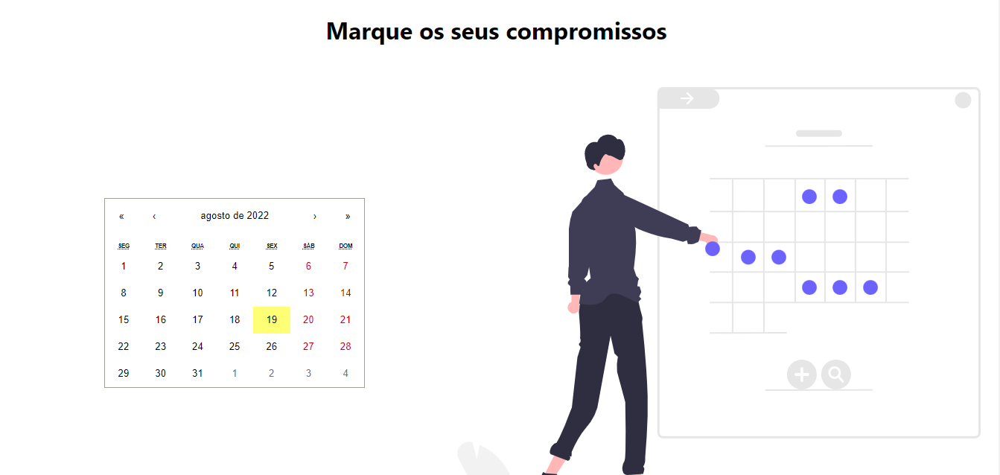
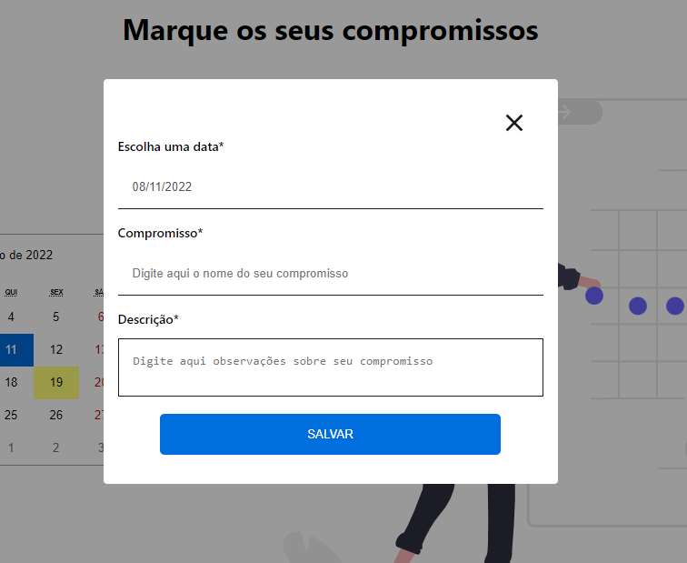
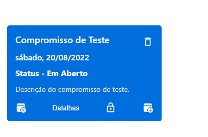
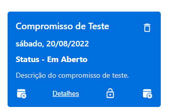
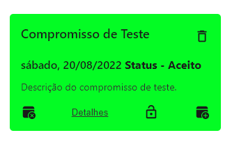
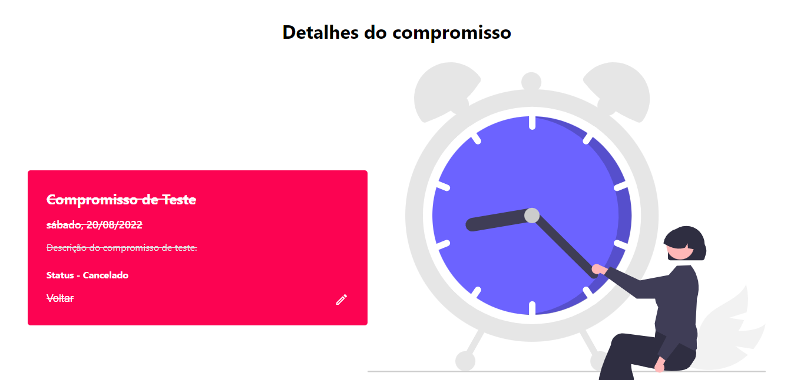

# A simple calendar app made in React.JS

<p>Calendar App 📅</p>

<p>
  
  
  
</p>


## Tópicos

[Sobre a aplicação](#sobre-a-landing-page)

[Tecnologias e Ferramentas](#tecnologias-e-ferramentas)

[Instalação e uso](#instalação-e-uso)

<br>

## App Calendar React.JS

<br>
 📅 O projeto consiste em uma simples aplicação de calendário construído em React.JS, onde é possível criar, aceitar, cancelar e deletar compromissos.
<br>
<br>

<br>

## Modo de usar.

📃 No screenshot abaixo temos a Home, onde contém um calendário, clicando em uma das datas do calendário será popado um modal, onde terá 3 campos de inputs, um de data, um para o nome do compromisso e outro para descrição.
<br>



<br>

## Modal para a criação do compromisso.


<br>

<br>
📃 Após preencher todos os campos e cadastrar o compromisso, um card contendo as informações do mesmo, será exibido logo abaixo. Conforme você for cadastrando compromissos, vai sendo gerados outros cards, um para cada compromisso.

<br>

## Card do compromisso.



<br>
📃 No card do compromisso contém todas as informações referentes ao mesmo. Também exitem 4 botões para ações. O primeiro botão que fica no canto inferior esquerdo, serve para cancelar o compromisso, o link do meio com o texto "Detalhes", te leva para a tela de detalhes do compromisso, o do canto inferior direto serve para aceitar o compromisso e o botão com ícone de lixeira, serve pra excluir compromisso.

## Status do compromisso.

<br>
📃 Se você observar bem no card há uma label com a palavra "Status" seguido de um "-" mais o status em si. Conforme você for clicando nos botões de ações, o status do compromisso é alterado e a cor do card, textos e botões também mudam, para indicar o status do compromisso.

<div>
  
  
  
</div>

<br>

## Tela de detalhes.



<br>
📃 Clicando no botão de detalhes você é redirecionado para a tela de detalhes, onde você consegue ver informmções mais detalhadas sobre o compromisso. Clicando no botão no canto inferior direito, um modal com os mesmos campos do modal de cadastro será popado em tela para que você posso editar as informações do seu compromisso.

## Agora teste você mesmo 👇🏿

[Calendar-App](https://onesight-app-frontend.netlify.app/)

## Tecnologias e Ferramentas

As seguintes tecnologias foram utilizadas no desenvolvimento do projeto:

- [React.JS](https://pt-br.reactjs.org/)
- [Typescript](https://www.typescriptlang.org/)
- [styled-components](https://styled-components.com/)

<br>

## Instalação e Uso

Para rodar a aplicação, você precisa instalar o [Node](https://nodejs.org/en/)

Siga os passos abaixo:

```bash
# Abra um terminal e copie este repositório com o comando
$ git clone https://github.com/vitorSantanaDev/onesight-app-front-end.git
# ou use a opção de download.

# Entre na pasta com
$ cd onesight-app-front-end

# Instale as dependências
$ yarn install

# Rode a aplicação
$ yarn start
```

<br>

---

Feito com :technologist: by [Vitor_Santana](https://github.com/vitorSantanaDev)

[](https://www.linkedin.com/in/vitor-santana-bbb607217/)
[](mailto:vitorsantana.developer@gmail)
